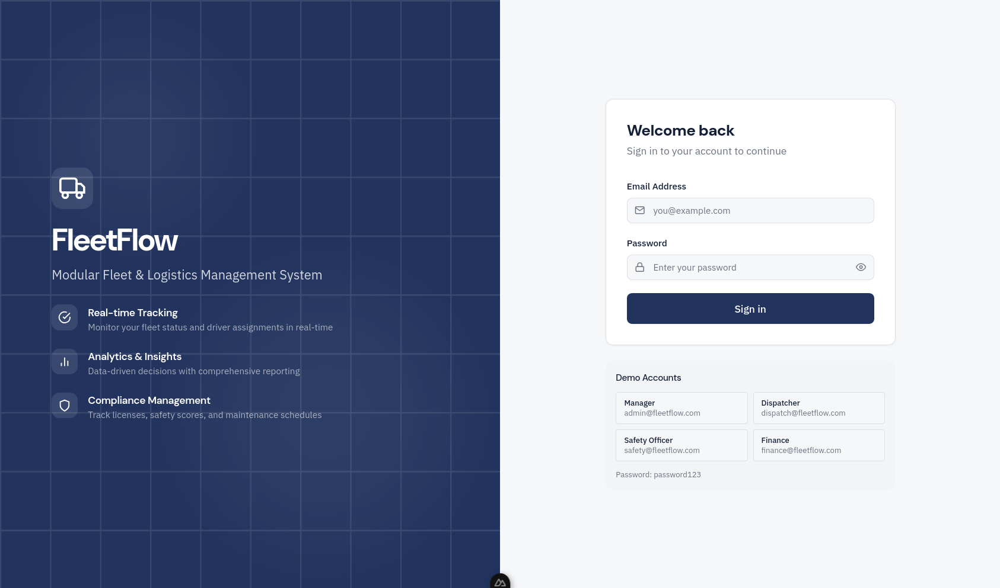

# FleetFlow - Modular Fleet & Logistics Management System

> Hackathon: **Odoo x Gujarat Vidyapith Hackathon '26**

A centralized, rule-based digital hub that optimizes delivery fleet lifecycle, monitors driver safety, and tracks financial performance.



## Tech Stack

| Layer | Technology |
|-------|------------|
| Framework | Nuxt 4 (Full-stack) |
| Frontend | Vue 3 + Tailwind CSS |
| Database | SQLite + Prisma ORM |
| Authentication | JWT |
| Language | TypeScript |

## Features

- **Dashboard** - Real-time KPIs (Active Fleet, Maintenance Alerts, Utilization Rate)
- **Vehicle Management** - CRUD operations with status tracking (Available, On Trip, In Shop, Retired)
- **Driver Management** - License compliance tracking and safety scores
- **Trip Dispatcher** - Cargo validation, auto-status updates on dispatch/complete
- **Maintenance Logs** - Auto vehicle status updates when logging maintenance
- **Expense Tracking** - Fuel logs and operational costs with summaries
- **Analytics** - Fuel efficiency charts, cost breakdown, ROI calculations, CSV exports
- **RBAC** - Role-based access control (Manager, Dispatcher, Safety Officer, Financial Analyst)

## Quick Start

```bash
# Install dependencies
bun install

# Setup database
bunx prisma generate
bunx prisma db push
bun run seed

# Run development server
bun run dev
```

Open http://localhost:4000

## Demo Credentials

| Role | Email | Password |
|------|-------|----------|
| Manager | admin@fleetflow.com | password123 |
| Dispatcher | dispatch@fleetflow.com | password123 |
| Safety Officer | safety@fleetflow.com | password123 |
| Financial Analyst | finance@fleetflow.com | password123 |

## Documentation

See `docs/` folder for detailed documentation:
- [Problem Statement](docs/01-PROBLEM-STATEMENT.md)
- [Tech Stack](docs/02-TECH-STACK.md)
- [Database Schema](docs/03-DATABASE-SCHEMA.md)
- [Pages Specification](docs/04-PAGES.md)
- [API Routes](docs/05-API-ROUTES.md)

## Team

- **Team Leader:** Atulya Rai
- **Mentor:** Bharat Singh Rathore ([@bsra-odoo](https://github.com/bsra-odoo))

## License

MIT
